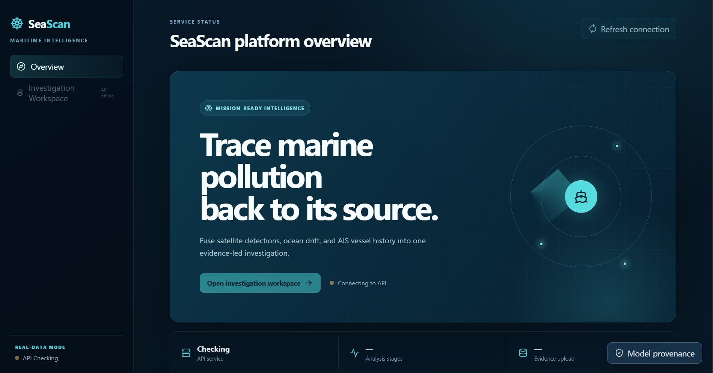
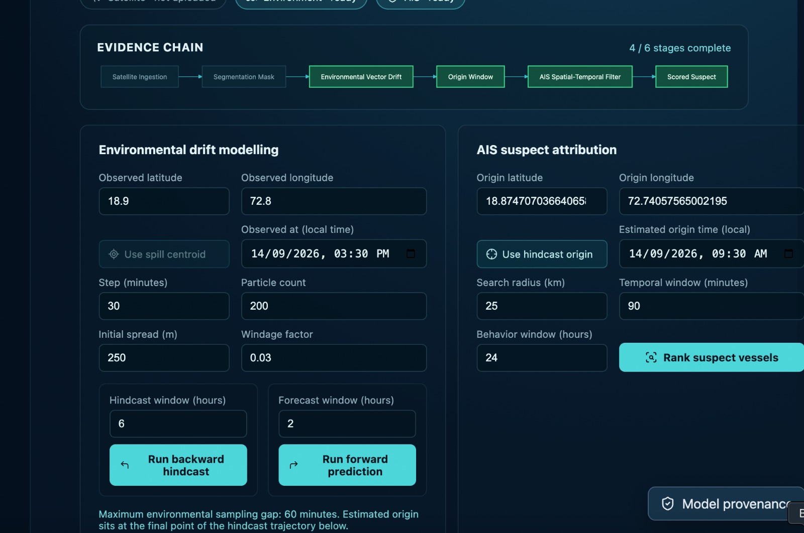
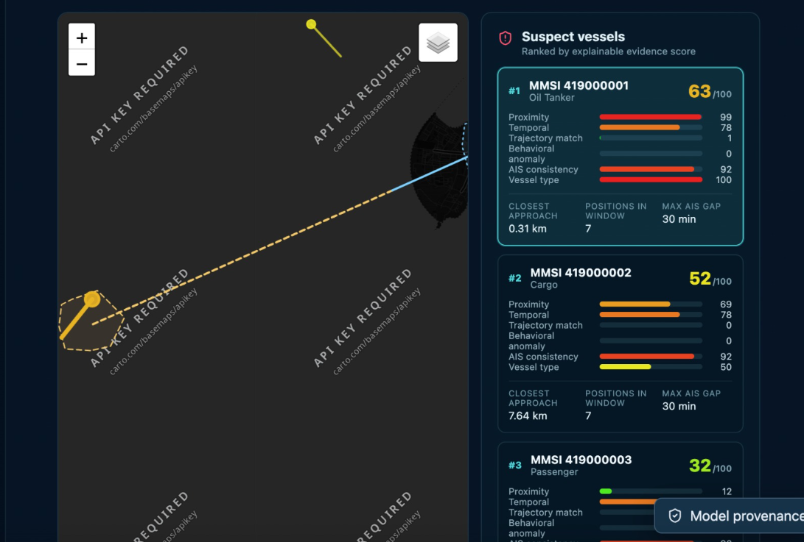

<div align="center">

# 🌊 SeaScan
### AI-Powered Marine Oil Spill Detection & Vessel Attribution Platform

[](https://www.sih.gov.in/)
[](#)
[](#)
[-brightgreen?style=for-the-badge)](#)

*Transforming early intelligence into measurable public value to protect our oceans.*

</div>

---

## 📖 Overview
Marine oil spills inflict catastrophic damage on marine ecosystems, yet the perpetrators often remain untraceable, committing environmental "hit-and-runs." SeaScan is an intelligent, automated pipeline designed to detect oil spills and identify the polluting vessel using remote sensing satellite data (SAR and EO imagery) and historical AIS (Automatic Identification System) tracking data.



By combining computer vision, environmental physics, and geospatial data fusion, SeaScan provides maritime authorities with the actionable, explainable evidence needed to hold polluters accountable.

---

## 🚀 The Evidence Chain (Core Features)

Our solution breaks down the investigation into three automated phases:

### 1. Detect & Validate (Oil Spill Segmentation)
*   **SAR/EO Detection:** Scans accessible satellite sources and segments slicks using a U-Net machine learning model[cite: 5].
*   **False Alarm Filter:** Uses context-aware validation and prior imagery comparison to filter out natural phenomena[cite: 5].
*   **Spill Extent Mapping:** Extracts the precise area, shape, and spatial extent of the validated spill[cite: 5].

### 2. Reconstruct Probable Source (Hindcasting)
*   **Age Estimation:** Estimates how long the oil has been on the water based on slick weathering and spread analysis[cite: 5].
*   **Environmental Drift Modelling:** Utilizes historical wind and current data (Copernicus, NOAA) to calculate a backward drift trajectory[cite: 5].
*   **Probable Origin Region:** Generates a specific time window and an uncertainty-bounded geographic region where the discharge likely occurred, rather than forcing a single, inaccurate point[cite: 5].



### 3. Attribute Candidate Vessels (AIS Fusion)
*   **Vessel Fusion:** Cross-references the calculated origin zone and time window with historical AIS records and visible ships in the satellite image[cite: 5].
*   **Explainable Ranking:** Scores potential suspect vessels based on spatial proximity, temporal trajectory matches, and behavioral anomalies (like unexplained gaps in AIS transmission)[cite: 5].



---

## 🏗️ System Architecture & Data Flow


The SeaScan processing engine operates as a four-stage pipeline:

1. **Data Ingestion:**
   * Ingests high-resolution satellite imagery (SAR and EO).
   * Queries external APIs for met-ocean dynamic vectors (Copernicus Marine Service, NOAA) and historical vessel tracking streams (AIS).

2. **Dual-Track Processing Pipeline:**
   * **ML Segmentation Track:** A deep learning PyTorch **U-Net** model segments raw slick geometries, routing candidates through a **False Alarm Classifier** to discard natural look-alikes.
   * **Computer Vision Track:** OpenCV modules scan the imagery for physically visible ships, estimate slick weathering/age by comparing against archival clean imagery, and extract geometric properties.

3. **Drift Hindcasting & AIS Trajectory Matching:**
   * Physics-driven backward tracing applies surface wind and ocean current vectors to compute an uncertainty-bounded origin cone and time window.
   * Intersecting AIS vessel tracks are isolated and evaluated across spatial proximity, temporal overlap, and movement patterns.

4. **Scoring & Attribution Dashboard:**
   * Combines all candidate vessels into an explainable scoring matrix (proximity, timing, trajectory, transponder drop anomalies).
   * Dynamically adjusts confidence scores based on slick age and sensor clarity, rendering the findings on an interactive map.

---

## 🛠️ Technology Stack

Our architecture is built on robust, scalable, and open-source technologies[cite: 5]:

### Frontend


### Backend & Database


 *(PostGIS Integration)*

### ML & Computer Vision


### Deployment


---

## 🌍 Impact & Operational Value

*   **Environmental:** Enables earlier containment, lower exposure of sensitive marine zones, and reduced ecological damage[cite: 5].
*   **Economic:** Lowers response costs and reduces losses to fisheries, tourism, and port activities[cite: 5].
*   **Social:** Protects coastal livelihoods, ensures safer marine resources, and builds stronger public trust through transparent enforcement[cite: 5].
*   **Strategic Value (For Authorities):** Replaces manual guesswork with an auditable, evidence-backed scoring pipeline, delivering "Speed, Trust, and Scale by design"[cite: 5].

---

## 💻 Local Setup & Installation

Ensure you have Docker and Docker Compose installed on your host machine.

```bash
# 1. Clone the repository
git clone [https://github.com/Prachi2424/SeaScan.git](https://github.com/Prachi2424/SeaScan.git)
cd SeaScan

# 2. Configure Environment Variables
# Copy the example file and populate API credentials (NOAA, Copernicus, etc.)
cp .env.example .env

# 3. Build and launch services via Docker Compose
docker-compose up --build

# 4. Access the platform
# Frontend Client: http://localhost:5173
# REST API Documentation: http://localhost:8000/docs
```

### Authentication and roles

SeaScan protects investigation, evidence, analysis, and report APIs with expiring bearer sessions. Passwords are stored as salted PBKDF2-SHA256 hashes; raw session tokens are never stored in the database.

- **Investigator:** creates cases, uploads evidence, runs analyses, and exports reports.
- **Analyst:** opens existing cases, runs or reviews analyses, and exports reports. Analysts cannot create cases or upload evidence.
- **Administrator:** has full operational access and can create, disable, enable, or reassign user accounts.

Development mode creates `investigator`, `analyst`, and `admin` demonstration accounts using `SEASCAN_DEMO_USER_PASSWORD`. For a non-development first startup, set a strong `SEASCAN_BOOTSTRAP_ADMIN_PASSWORD`; SeaScan will refuse to create an insecure default production administrator.

## Tiled satellite inference

Tests generate temporary, untrained checkpoint fixtures exclusively to verify
loading and validation. No test weights or metrics are used by the application.

Satellite uploads now use 256-pixel tiles with 64-pixel overlap and weighted probability blending. GeoTIFF reads are windowed. Normalization is shared across tiles using scene percentile estimates from up to 512x512 sampled pixels; small scenes use all pixels. NoData pixels are excluded. GeoTIFFs must contain a CRS.

Limits: 16,777,216 pixels for GeoTIFF, 4,194,304 for PNG, and 10,000 output components, in addition to the upload byte limit. PNG decoding and final probability/mask arrays still use scene-sized memory. Crop scenes larger than these limits. Tiling reduces model activation memory but may change large-scene predictions; independent accuracy evaluation remains necessary.

Regression coverage: `backend/tests/test_tiled_inference.py`.
